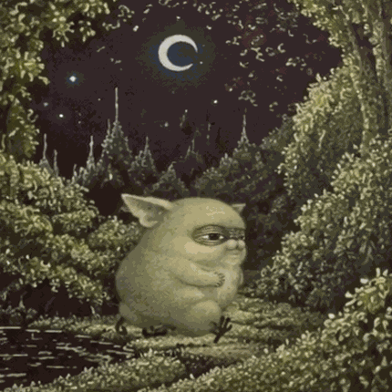

<div align="center">



# 🌙 Шаббат Шалом, я Лунный Джомолунгма

### 🌲 пишу код среди мха, леса и гор 🏔️

`Python` • `C++` • `JavaScript` • `Git`

              🌲 🏔️ 🌲

</div>

---

## 🌲 Обо мне

- 💻 Изучаю разработку и пишу свои проекты.
- 🐍 Больше всего работаю с **Python**.
- ⚙️ Также изучаю **C++** и **JavaScript**.
- 🤖 Интересуюсь ботами, автоматизацией и AI.
- 🧗 Люблю скалолазание, горы и всё, что можно делать подальше от города.
- 🌙 Этот GitHub принадлежит **Лунному Джомолунгме**.

---

## 🛠️ Мой стек

<div align="center">


&nbsp;&nbsp;

&nbsp;&nbsp;

&nbsp;&nbsp;

&nbsp;&nbsp;

&nbsp;&nbsp;

&nbsp;&nbsp;

&nbsp;&nbsp;


</div>

---

## 🏔️ Что мне интересно

```text
🌲 леса и дикая природа
🏔️ горы и альпинизм
🧗 скалолазание
🌊 реки, озёра и горячие источники
🌙 ночные прогулки
💻 программирование
🤖 боты, автоматизация и AI
🎧 BONES / $uicideboy$
```

---

## 📊 GitHub

<div align="center">


</div>

<div align="center">


</div>

---

<div align="center">

## 🌙 История Лунного Джомолунгмы

*где-то между Темнолесьем и горами...*

</div>

### 🌲 Темнолесье

Я живу в **Темнолесье**.
Большую часть времени меня можно найти среди старых деревьев, камней, ручьёв и мха.  
Сплю я прямо во мху, а когда начинается сильный дождь — забираюсь в дупло старого дуба.

Люблю лесные ягоды и золотой корень. Особенно золотой корень.  
Его удобно грызть, пока думаешь, почему код опять не работает.


### 🏔️ Горы

Иногда я ухожу из Темнолесья далеко в горы.
Люблю лазать по скалам 🧗, сидеть на высоте и смотреть, как лес постепенно исчезает в тумане.  
Если ночь застаёт меня далеко от дома, я нахожу пещеру и остаюсь там до утра.

Иногда рядом шумит горная река 🌊.  
Иногда вокруг вообще ничего не слышно.
Только ветер.
Когда становится холодно, я спускаюсь к горячим источникам и долго грею там лапы.

### 💻 Как в Темнолесье появился код
Однажды далеко от тропы я нашёл погибшего туриста.
Рядом с ним лежал ноутбук.
Я забрал его.

Позже среди вещей нашлись **Starlink**, солнечная батарея и **powerbank**.  
Так в Темнолесье впервые появился интернет.

Сначала я просто смотрел на экран.
Потом начал разбираться.
Потом написал первую программу.

Теперь иногда глубокой ночью между деревьями можно увидеть странное холодное свечение.
Это не болотные огни.
**Это я опять программирую.**

Ноутбук я заряжаю от солнечной батареи.  
Если несколько дней подряд идёт дождь, приходится экономить заряд и писать код быстрее.

### 🎧 Музыка из дупла

Когда Starlink впервые поймал нормальный сигнал, я скачал все альбомы **BONES** и **$uicideboy$**.
Теперь интернет мне для этого не нужен.

Иногда ночью я лежу во мху и смотрю на луну. 🌙  
Иногда слушаю музыку.  
Иногда пишу код.

Обычно всё одновременно.

---

<div align="center">

###  🏔️ 🌙 

*Если в Темнолесье ночью светится дупло — скорее всего, там компилируется проект.*

</div>
